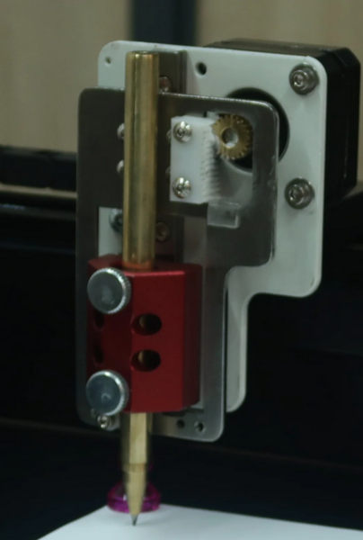

# Plotter product categories

| Name                | Price  | Ease of use | Versatility | Performance    |
| :------------------ | :----- | ----------- | ----------- | --- |
| Vintage pen plotter | $$ - $$$ | + | 0 | ++++ |
| DIY | $ - $$$ | + | ++++ | +/+++ |
| Modern pen plotters | $$$ | ++ | ++ | ++ |
| Cheap kits | $ - $$ | + | ++ | ++ |
| Toy plotters | $ | +++ | - | - |
| Hobby vinyl cutters/plotters | $$ | +++ | ++ | ++ |
| Vinyl cutters | $$ - $$$$ | +++ | + | ++ |
| Pen attachment for your existing CNC device or 3d printer | $ | + | ++ | ++ |

## Vintage pen plotters
There was a period of time when pen plotters served a similar  role as office printers and for a slightly longer period for plotting large format engineering and architectural drawings.
Somewhat wide commercial use meant that the machines were very well engineered and optimized for one specific task which resulted great performance even by modern standards. Lightweight construction allows fast movement and acceleration. But more impressively solenoid based pen lifting mechanism in some machines is capable of lifting the pen 20-30 times a second.

One thing that might slightly held them back is limited computing power and data transfer rate. At their time this was partially compensated by having builtin commands for things like dotted lines, polygon fill and circles. Currently, unless you are making your own software for your specific drawing and plotter, you are more likely to generate arbitrary vector drawing and then convert it to the language plotter understand by splitting all lines into into short segments.

Two major subcategories are flatbed plotters and roller based ones. For the flatbed ones paper stands still and the pen moves along x and y axes. This means that plotter needs to be bigger than the paper sheet you are drawing on and it takes a lot of space on the table. Some of them where designed to allow standing at angle, not quite vertically.
Roller based ones use rollers to move paper back and forth along Y axis, with X axis being stationary, similar to how modern printers work. This approach was used both for desktop sized plotters, also large ones supporting up to A1 or A2 size paper.

Depending on how well it's preserved you can find deals for $200-$600, broken ones sold as parts only in $50-$150 range. Since it's not that easy to run them with modern computer not all sellers can easily test if the plotter is in working state, so you can occasionally be lucky and find a working one sold as "parts only". 

As with any vintage device availability is of spare parts and consumables is limited. It will likely need some tinkering to keep it running. Some plastic parts might be broken, rubber deteriorated. 
If you are lucky someone has already designed and shared models for 3d printable replacements. 
These types of pen plotters are usually meant to be used with specially shaped stubby pens. You can find some old stock in the various marketplaces, but if you are going to do a lot of plots that can become costly. So you will also likely make an adapter for pens. 
One more problem with using modern pens is that the original pens were very short and rest of machine designed with that in mind. This is mostly a problem for roller based plotter with pen changers or a plastic cover over the moving parts. Flatbed plotters are more likely to be compatible with longer pens without any modifications except the mounting adapter.

One bright side in terms of repairability is that at the time these plotters where made, manufacturers providing a service manual with full schematics and detailed troubleshooting steps was still common.

The optimized design comes at the cost of versatility. Loading an arbitrary pen or paper can be problematic. Again flatbed plotters are slightly better as you can more or less place any paper or flat material smaller than maximum size, but the roller based ones will likely expect very specific paper sizes and fail to feed anything which isn't normal thickness office paper. Rollers can also be problematic if they go over any wet ink smudging it. You would at least hope that roller based plotters have infinite Y axis, that isn't always the case. Plenty of roller based plotters only support specific standard paper sheet sizes, and even if paper rolls are supported accuracy over for plots bigger than 1-2 meters isn't guaranteed.
Well optimized design means limited Z axis movement range and pen pressure, so using anything which isn't a normal pen will likely not work.

Other major drawback is related to ease of use of use, connection and software setup. It's not exactly a plug and play process. You will likely need a some kind special adapter for connecting to modern PC. And not every adapter will properly function with every device. After electrical connection, next challenge is connection parameters. Serial port has half dozen parameters which need to be configured exactly the same on the plotter and the software running on your computer. Consult the documentation of your plotter to find out correct values, don't attempt to guess randomly there are way too many different combinations. Often these can be changed on the plotter using dip switches on the back of plotter. 
Third step is the actual printing. Instead of trying to get drivers and configured like regular printer (with exception of drivers for adapter if needed) treat it like generic serial port like device. There is a bunch of software meant for either directly interfacing with such plotters, or converting svg to the language plotter understands and then you send the file using some other software. You can also write your own script which directly generates the drawing in language understood by your plotter. The languages used by plotters were very simple but somewhat high level at the same time compared to modern formats so it's not too difficult if you have some programming knowledge. Usually it's either HPGL or GPGL or something based on those two, but there can also be a bunch subtle differences between each machine. So check the manual especially if you are planning to use anything more advanced the move to position, draw straight line.

While the speed for straight lines and pen lifting/lowering is quite good, CPUs in these plotters are somewhat slow. Drawing circles or other curves can be much slower compared to straight lines. Stepper driver technology also has advanced over the years. Modern stepper drivers like those made by Trinamics can be much quiter compared to vintage pen plotters.

## Modern pen plotters
For most practical use cases pen plotters have been replaced by other printing technologies. Modern "Plotters" that you might find in architecture firms are just large size inkjet printers. This means that new commercial plotters is a very small niche, with few manufacturers. 

The small market means there is not enough money to make serious engineering effort optimizing the build for performance or price. Currently the 2 main sellers are Bantam tools (previously Evil mad scientist with Axidraw machines) and other is UUNA TEK with iDraw machines. Costing somewhere between $500-$1500 for A4-A2 sizes and up to $5000 for largest machines.

If you compare the pen plotters to similar price medium/high end hobby 3d printer or low end CNC machines. Pen plotter by the requirements is already much simpler machine. But even with that advantage the modern pen plotters are much closer to DIY machines than they are to machines of other types or plotters from 40 years ago. This isn't meant to be an insult for the creators of those machines, more of an observation about reality of market and what happens when economies of scale and competition do not apply.

For some people slightly smoother overall experience might be worth it.

## Toy plotters

Different type of new commercially available pen plotters is sold as kids toy. Consisting of 3 hobby servos and using 5-bar linkage to move the pen. It usually costs ~$50-$100. The drawing area is very limited, maybe 15x15cm, and the accuracy isn't great either.  Sometimes there are cards or something similar for drawing one of the builtin image (it's meant to be a kids toy they aren't supposed to need a computer for using it), there might be a mobile app which allows making custom drawings. Some examples: Line-us, WeDraw (canceled kicstarter), "Quincy The Robot Artist". Some of them have speaker for giving children instructions how to draw the same thing. Some are sold as barebone kit more as a STEM toy.

## Cheap kits or preassembled machines from Ebay/Aliexpress 
If you don't want to design a DIY machine or the previously mentioned prices are way above your budget you can find a bunch of relatively cheap machines from ebay/Aliexpress or other similar marketplaces. 
Costing ~$100-$150 for small sizes up to $400 for bigger ones. That's closer what you would expect considering the prices of 3d printers using the same parts. 

If you want to save money and are ready for little bit of DIY instead of buying bigger ones it will be cheaper to get the smallest one and buy longer aluminum extrusions, belt and wire separately. Extra parts should cost <$50, nowhere near the hundreds of dollars that sellers are asking for size difference. This is a bit trickier if the machine has linear rails instead of V-wheels. Similar pricing logic applies to the different sizes of machines in "Modern pen plotters" category but you can't as easily extend them, because they might be using less common type of aluminum extrusions which will be much harder to source on your own. One more thing to keep in mind is that you can't extend it infinitely this way, at certain size it will become unreliable and require different hardware design or at least beefier components motors, rails, motor driver.

The ones costing $100-$150 aren't a bad deal, if you tried to source exactly the same parts yourself it's not hard to end up with slightly higher cost especially considering shipping cost when ordering from multiple vendors.

Cheap price comes with it's downsides (which might not be a problem depending on your skill set).

There is a bit of lottery factor with these sellers. Not so much that you won't receive anything at all, but you might not receive exactly the same thing as in pictures. 

Related problem with cheap kits consisting almost purely from off the shelf components is that sellers might be substituting parts without ever testing whether all the parts fit together. Stuff like swapping a buttonhead screw (flatter and wider) with one that has cylindrical socket head (taller and narrower), replacing countersunk with non countersunk, changing the belts to slightly wider or narrower ones, replacing motors with ones that have wires attached on different sides, replacing 16teeth pulleys with 20teeth, different type of mounting brackets and so on.
Small changes like that might cause parts to interfere during assembly. Or seller might forget to substitute all the related parts. In a well designed machine unless it something very compact, changes like that are usually fine. You wouldn't normally design everything with tightest fit possible places as that not only makes part substitution but also accounts for variance within same part and also makes assembly process easier. Good sellers would test such things, but you can't expect the same from sellers who can't even be bothered to make their own pictures or write description for store listing.

Don't expect high quality, accurate instructions and be ready to figure out things yourself.

One more potential upgrade for these is replacing the controller board. Many of these plotters use same controller board as axidraw to allow using with axidraw software. It's a <10years old board with underpowered microcontroller and custom protocol supported supported almost exclusively by axidraw sofware. See [Diy plotters](./diy-plotters.md) for alternative choices. You can now get much more powerful controller boards, with better feature set and supported by wider set of software for 1/3 the price of EBB board.

Related category of machines is cheap non enclosed laser engravers, sometimes also sold as laser engravers/plotters. The movement part of these are very similar to previous, but maybe slightly higher quality with more custom parts. Makes sense since the laser engraves have significantly bigger market for making customized gifts and merchandise and wooden trinkets, and it's not something which can be easily substituted by other technique.
My recommendation is stay away from these or at least immediately throw the laser module part into a bin. They are recipe for permanent eye damage to you and everyone around you. And you need proper ventilation. Laser cutters are not something to be used in your living room with children or pets running around.
From the perspective of modifying one for pen plotting, a lot these have X axis high above desk surface. This is both due to height of laser module and also to support engraving various physical objects not just sheet material. It leads to significant stickout for the z axis and tool, which is fine for a laser engraver that has no side loads, but not optimal for pen plotting. You want the pen to be held as low as possible to minimize deflection.

* DBU21
* ly drawbot

## DIY builds
For more information read [DIY plotters](./diy_plotters.md)

DIY builds is the category which can vary the most. You can make something very cheap, or you can make something with decent performance which compares to modern pen plotters at half the price.

The existing ecosystems of DIY CNC machines and more lately 3d printers means that there is wide availability of mechanical parts, electronic parts, controller boards and software. 

Some of the cheapest builds will likely be wallbot/polargraph style or hobby servo based scara type. 

## Tabletop hobby plotters/vinyl cutters 
Compared to alternatives small format vinyl cutters meant for crafts and arts can be cheap option. These type of machines are meant not just for vinyl-cutting but also various crafts and arts projects like various paper crafts, making fancy greeting cards, scrapbooking, lightweight cloth cutting for quilting.

Price is in $200-$400 range.

Most common brands are Silhouette with their Cameo series, Brother with ScanNCut and Cricut. 

Software is one of the strongest and weakest parts of these machines. One hand it they provide high quality easy to use software, which comes with presets for the various tools and materials. On the other hand all 3 manufacturers try to steer you towards their subscription service. With some of functionality arbitrary locked away behind higher subscription tiers. In some of the cases even basic functionality like "upload your own design" is considered premium feature. Before buying do a proper reasearch and consider if you are fine with the business practices of specific manufactuer.

In terms of versatility while they can partially limit your paper and pen choices that is somewhat compensated by being able to do various non drawing projects. They are also designed to be used with cutting mats and potentially thick materials, so while they are roller based, paper limitations aren't as bad as other roller based machines.

## Vinyl cutters
Commercial larger format vinyl cutter from well known brands like Roland or Graphtec can be quite pricey up to few thousands. But there are also some options from less known Chinese brands like Vevor which have models in $300-$1000 range.

Almost all the vinyl cutters are using roller system. This and all it's associated problems is one of the biggest downside using one as a pen plotter.

## Pen attachment to for your existing CNC device
If you already have some kind of computer controlled device like a CNC router or a 3d printer, you can make a pen attachment for it.
And since you have it means you already have the tool for creating the attachment. 

Don't forget that the pen mount needs to be spring loaded (rubber bands can be used as well), so that you can get reliable pen pressure without worrying about surface not being perfectly flat. See the [Z axis](#z-axis) section for more details. If you ignore this something will bend anyways, either the pen or frame of your device. The bed of some 3d printers is mounted on springs, don't rely on those for this purpose. They are very stiff and preloaded, compressing them even by fraction of millimeter will take way more force than you should use with a pen.

The downside to this approach is that Z axis in most 3d printers isn't very fast, since during normal usage there is barely any Z movement. It's not problem for small simple drawings, but for larger ones with more than 10k-100k pen lifts this can be a major bottleneck. If you finetune everything so that you only need to lift the pen <1mm, it might not be so bad, but that will be hard to combine with reliable pen pressure.

You can find existing models designed specifically for many of the most popular 3d printers https://www.printables.com/@Kabacis_332837/collections/1870430 .

# Pen plotter types

## Standard Cartesian build
The most straight forward thing to have is having X,Y,Z axis perpendicular to each other, and each controlled by their own stepper motors. The classic approach is having all 3 axis stacked serially in the order Y, X, Z. 

There are other common axis setups used by different kind of CNC machines, but they make less sense for pen plotters.

Since the X axis mounted on top of Y there needs to be way to move both ends of X axis. Pushing just one of them would likely result in skewing or jamming. One solution is just having 2 motors for Y axis, that's what many CNC routers for cutting sheet material do. Otherwise you need to somehow synchronize the 2 sides of Y axis. Many of the cheap non enclosed laser cutters, use a rotating metal rod for connecting the belt on two sides.

Downsides:
* two sided Y axis increase total part count and the mechanical complexity
* X axis motor rides along the Y axis thus increasing moving weight and limiting acceleration

## H-bot
(See [T-bot](#t-bot) as simpler version of this if you want to understand how this work)

H-bot has it's name from the shape of it's belt path. The frame also has H shape, but not every ploter with H shape is H-bot. Instead of having separate motors controlling each axis, there two motors connected to single loop of belt. Both motors are responsible for X and Y movement. Depending on whether they are spinning in same or opposite directions you will get the movement along either X or Y axis. Spinning just one them will result in diagonal movement. While this might sound complicated all decent controller firmwares should have a builtin mode for this type of kinematics, so you don't need to worry too much about it.

Downsides:
* belt path introduces twisting force for the x axis
* single very long belt loop

Benefits:
* X and Y motors are mounted in fixed position, they don't move along axis, thus decreasing movable weight

## Core-xy
One of recent trends among 3d printer builds is having core-xy kinematics. It shares many of the properties with H-bot, but solves some of it's downsides at the cost of slight increase in complexity.

Note that there is large amount of seriously flawed core-xy designs out there. Before designing your own, or making someone's else design I would recommend reading some articles so that you are aware of potential pitfalls and how to avoid them.

Benefits:
* fixed motor mounts -> less moving weight thus better acceleration and speed
* slightly shorter belt paths compared to H-bot

Downsides:
* more complex belt path

Misc posts:

* https://drmrehorst.blogspot.com/2018/08/corexy-mechanism-layout-and-belt.html
* http://www.corexy.com/theory.html

## T-bot
T-bot consists of two straight pieces connected in a cross or T shape. Similar to H-bot the T-bot has single belt connected to two motors and moving in X or Y direction requires turning both motors at the same time.

Due to simple and cheap design this is common design used both by commercial machines like Axidraw, cheap DIY kits, and also various DIY builds.

Benefits:
* small part count -> cheap
* fixed motor mounts -> less moving weight
* While not being used, doesn't take too much space

Downsides:
* Takes alot ot space while being used. Working area is less than half of space taken by machine while active. Can't be placed next to a wall. 
* Cantilever design causes a lot of force in the central connection, can result in unsupported end drooping and variance in vertical position depending on X position.

* https://www.youtube.com/watch?v=Ww2grGsl3Dk (video explaining how T-bot works)

## Roller based plotters
Roller based plotters move the paper along Y axis using rollers. This has an advantage of being more compact and avoid the need for Y axis to move whole X axis assembly thus resulting in overall lighter and simpler design. 
This is an approach used by many of vintage plotters and modern vinyl cutters. This design also allows handling rolls of paper, which can be more convenient and cheaper to handle compared to individual paper sheets. 

But not all roller based plotters support paper in in rolls, some plotter models have variants with and without paper roll support. 

Not all roller based plotters fully utilize the space saving benefits of roller system. HP 7470A has a shelf for the paper end in front and back of roller system, making the plotter depth almost as big as the paper length it's using.

Also be aware that many roller based devices support only very specifc paper widths due to limited positions of top and bottom rollers.

Roller based design is less common for DIY machines, as it's tricky to get it working right and reliably especially for bigger paper sizes. Something like A4 is not so bad. Even commercial machines occasionaly have notes like about position not being reliable for plots longer than 1-2m assuming it's even supported. I don't recommend trying to make a roller based machine, unless you are up for a serious challange and are more interested in mechanical tinkering than getting a functioning pen plotter at the end.

Many of the DIY roller plotters are either inspired or directly based on design done by "IV projects".

* https://www.youtube.com/watch?v=wX90X4rVUr8
* https://www.youtube.com/watch?v=DeLeu5LkZCo
* https://github.com/IVProjects/Engineering_Projects/tree/main/ProjectFiles/Pen%20PlotterV2
* https://github.com/IVProjects/Engineering_Projects/tree/main/ProjectFiles/High-Speed%20Pen%20Plotter
* https://www.thingiverse.com/thing:3789969
* https://www.youtube.com/watch?v=AuwU73lvwYM

* https://github.com/BenjaminPoilve/Liplo

## Wallbot/polargraph/ ...

This style of machine consists, of main pen hanging on string/chain between two motors.

This type of plotter can be very cheap, for the simplest version you need:
* 2 stepper motors
* controller board
* 1 hobby servo
* wires somewhat long
* string
* power supply
* means to mount it all on a wall or maybe a whiteboard
Everything else (which isn't a lot) can be 3d printer, made from junk or any other material you are comfortable working with. 

It is also one of the simplest ways for very large plots.

The precision and speed will likely not be very good. 

* [Polargrpah](https://www.instructables.com/Polargraph-Drawing-Machine/)
* [Hetor](https://juerglehni.com/works/hektor)
* [Makelangelo](http://www.makelangelo.com/)

## SCARA/5-bar linkage
Technically SCARA and 5-bar linkage mean slightly different things, but many of the plotters discussed are both, so it helps searching if you try both names. A serial SCARA robot wouldn't be using a 5-bar linkage.

In theory SCARA robots can be very fast, and have relatively large working area which is bigger than their footprint. The main industrial application is picking up and moving around small parts, similar to delta robots.

The potential for speed comes from lightweight arms and having all actuators being placed in main pillar and not having to move around.

In practice most pen plotters using this type of mechanism are very slow, with small working area and quite imprecise. 

Most common categories are either toy robots described in [Toy plotters](#toy-plotters) section, or DIY builds also using 2-3 hobby servos. This is one of the cheapest/simplest pen plotters you can make. In the most minimal case you need
* 2-3 hobby-servos
* any microcontroller board
* power source

The arms can be built from any junk, it's not going to be precise or very fast anyway. These types of cheap plotters DIY plotters are more of robotics learning projects with the build process and programming them being more important than using final result as practical pen plotter. This means that use of a well known CNC controller firmware is less useful allowing to use almost any microcontroller instead of purpose built 3d printer or CNC controller board. Another simplification comes from using only hobby servos which thus removing need for stepper motor drivers.

It is possible to make less floppy and fast SCARA plotter, and you can find some DIY projects doing that. Although those are mostly non plotter robot arms used as medium/high complexity robotics learning exercise. A high performance SCARA arm will likely need somewhat beefy mechanical design and powerful motors. 

The lack of precision comes in typical DIY builds comes from multiple factors:
* Extended arms have a lot of leverage on the joints which makes everything flex a lot more than comparable Cartesian design
* A hobby servo will likely have no more than 10-14bits for full motion range of ~90-180°. A stepper motor without microstepping has 200steps (<8bits) for 360° and microsteps might add up to 8 more bits. Any easily accessible angle sensor will also likely have no more than 10-14bits of resolution. By very rough estimates with 5 cm arms that gives ~0.1mm resolution which doesn't sound so bad. But as the area increases angle accuracy doesn't improve. All the movement range comes from angle accuracy of less than single motor turn. In most other robot designs single motor turn is responsible for a small range of motion, and for longer moves you perform multiple turns of motor. For comparison typical Cartesian design with stepper motors will likely have resolution of 0.16-0.2mm without microstepping, once you add microstepping you get resolution of 0.0008-0.0125mm and it isn't affect by working area size.
* One more source of bad precision and jerky movement comes from the math required to transform the x y coordinates to motor angles. It requires moderate moderate amount of trigonometric calculations. Even worse you can't just calculate angles for endpoints of movement and linearly interpolate between the two, you need to do full calculations for all the intermediate points. Doing this thousands of times per second on a microcontroller which might not even a have a floating point unit can be a problem.

Some examples
* https://www.brachiograph.art/
* https://www.youtube.com/watch?v=a46DMy_3xc4
* [Mechpen](https://tinkerlog.com/2019/08/27/mechpen/) (large one)

## Uncommon designs

*  https://github.com/bdring/Polar-Coaster

### Rolling plotter

* https://builds.openbuilds.com/builds/a-rolling-plotter.9207/

# Z axis
Requirements of pen plotters compared to other CNC machines have some unique challenges, but it also opens doors for solutions which wouldn't be suitable in other devices.

Pen plotters don't really need arbitrary z axis movement. It's only necessary to lower the pen so that it touches paper and lifting it above paper.

## RC servo

One of the cheapest and simplest option is using a RC servo.

Good parts:
* doesn't need a separate motor driver
* doesn't need homing
* (smaller ones) can be very light

Downsides:
* Limited motion range
* Cheaper ones will wear out after a while
* Noisy and not the fastest

## Solenoid

Good parts:
* very fast (up to 10 dots per second or better)

Downsides:
* noisy
* very limited motion range (1-3mm)

Note that while the theoretical movement range of many solenoids might be 10-20mm, the force drastically falls outside the sweet spot. A solenoid might have >500g of force at one end of movement, but after just 1mm of travel it will likely be halved, with next mm halving it again. On the other end of 10mm travel you might get less than 5g of force barely enough to overcome the return spring. 

So if you design a z axis expecting 20mm of travel from solenoid, it will likely be way too strong and weak at the same time.

## Stepper belt ring
An interesting approach using a stepper motor for Z axis is used by [LumenPnP](https://www.opulo.io/products/lumenpnp) machine. A single vertically mounted belt loop with 2 toolheads attached, one on each side. This gives movement of 2 tools for the cost 1 stepper motor.

Software and firmware setup could require more customization than usual since both extremes of the axis cause one of the two tools to be activated.

## String/Stepper belt pulling up
A string or a belt can only apply force in tension, it can't push things. Usually that's a limitation, but in this case it's a feature. Belt can be used to pull the pen up, while leaving downward motion to gravity or a spring.

Unlike the stepper belt ring approach, this doesn't need a belt tensioning mechanism.

A slightly more complicated version of this can be seen in UUNA TEK iDraw machines. 

## Stepper with rack/pinion on single rail
Somewhat unique plotter Z axis design can be seen in UUNA TEK 3 devices. Vertical motion is achieved using rack and pinion. It uses a clever solution for dealing with double slide problem by having two carriages on the same linear rail.
Rack and pinion mechanism lifts the silver color metal plate. But the pen holder (red) is using separate carriage isn't directly connected to the plate. Lifting the plate also lifts the pen holder, but due to the shape of hole lowering the plate doesn't push the pen holder down.

* https://www.printables.com/model/868919-generative-pen-plotter-art-cnc-arduino-vinyl-cutte

## (not recommended) Lead screw
Many DIY CNC machines use some kind of lead screw mechanism for lifting and lowering Z axis.

That makes sense for CNC routers where you might be lifting a spindle which weights a few kg, or 3d printers lifting whole X axis assembly or the printbead. It makes less sense for pen plotters. 

Leadscrew does 2 things it converts rotational movement into linear motion and it provides a force/distance trade off. It also provides a simple mapping from the motor angle to vertical distance, something like 1 turn or 1 stepper step being equal to x mm of vertical travel.
In some cases you can't even backdrive the leadscrew based Z axis thus which prevents it from falling down when motors are turned off. In pen plotters you want the opposite -> force requirements are minimal and you want to move it as fast as possible. It is also not necessary to have control over exact Z position.

Any leadscrew based design will also likely need secondary sliding mechanism for ensuring consistent pen pressure without crushing the pen.

## Tilting
Instead of having some kind of vertical linear rails, which requires some less common components. It is sufficient to have simple tilting mechanism requiring at most regular ball bearings, but a smooth metal pin against plastic should also work. 

Downside to this approach is limited movement range and pen tilting as gets lifted. If everything is well designed it's not a problem.

## Side mounted actuator
Instead of having Z axis actuator move along X axis, it can be mounted at the end of X axis. In this setup it lifts or twists a long bar which in turn lifts or lowers the pen. 

This is the approach used by many medium and small size vintage pen plotters, for example HP 7475A.
The actuator which you mount on the side can be anything: solenoid, stepper motor, hobby servo. Most of the vintage plotters used solenoids for their fast movement, but many newer DIY designs choose steppers or hobby servos as there are more examples of using them in DIY CNC machines.

Getting this right and functioning takes more upfront engineering effort taking into account positioning, movement range and forces of each component.

Not strictly required but this approach is occasionally combined with one more trick -> reusing the X axis linear bearing for tilting the pen holder. The trick is best best illustrated by this DIY build from IV Project https://www.youtube.com/watch?v=wX90X4rVUr8 .

Benefits:
* very lightweight tool head
* allows using powerful actuator with no weight penalty
* toolhead can be fully passive (no electronics or wires attached)

Downsides:
* small Z axis movement range

# Pen changer mechanisms

## Rotary pen changer

Used by many of roller based vintage plotters. Requires only single motor for spinning the carousel of pens and clever latching mechanism allowing to take and return the pen by bumping the pen holder against carousel. Usually holds ~6-8 pens.

Examples: HP 7475a, HP7440a

## Linear pen changers

Mostly used by flatbed vintage plotters, but there is at least one case of linear pen changer being used in roller plotter.

Consists of pens being placed at the edge of drawing area and a latching mechanism similar to rotary pen changer. This allows pen changer to be fully passive without any additional actuator beside the ones used to do x/y motion.

Sometimes also used by DIY machines, tricky part is having a mechanism which allows reliably grabbing and releasing the pen but holds it rigidly without wobble while drawing.

Typical example - Roland DXY series.

* DMP-161 - unusual case of roller plotter with linear pen changer https://www.youtube.com/watch?v=JGgGQGiP4As

## Multiple pens in tool head

There are a few similar receipt printer size pen plotters using small metal capsule shaped pens. They have a rotating pen changer mechanism holding 4 pens built into the toolhead. That way there is no need to grab or release a pen during change. It only needs to rotate which was also done by bumping the mechanism against end of x axis.
    * https://homecomputerguy.de/en/2021/12/26/commodore-vc-1520-plotter/